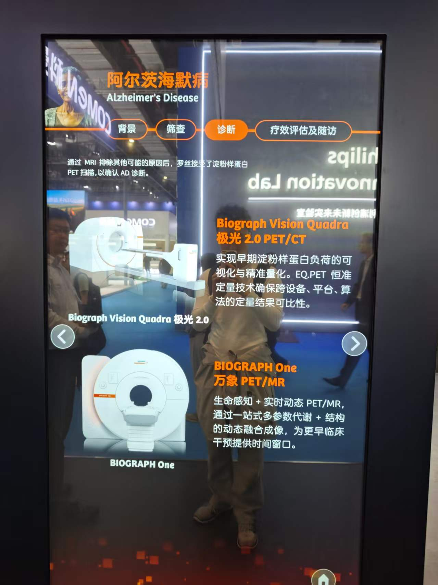

# Simens Realse

## AD Related

### Simens: ARIA-H 磁共振AD预测方案
- CMEF 2026
    - 
    -  
    - 
- The advent of anti-amyloid therapies (AATs) for Alzheimer’s disease (AD) has elevated the importance of MRI surveillance for amyloidrelated imaging abnormalities (ARIA) such as microhemorrhages and siderosis (ARIA-H) and edema (ARIA-E). We report a literature review and early quality assurance experience with an FDA-cleared assistive AI tool intended for detection of ARIA in MRI clinical workflows. The AI system improved sensitivity for detection of subtle ARIA-E and ARIA-H lesions but at the cost of a reduction in specificity. We propose a tiered workflow combining protocol harmonization and expert interpretation with AI overlay review. AI-assisted ARIA detection is a paradigm shift that offers great promise to enhance patient safety as disease-modifying therapies for AD gain broader clinical use; however, some pitfalls need to be considered.
    - https://www.ajnr.org/content/early/2025/07/30/ajnr.A8946

---

## Amyloid-Related Imaging Abnormalities (ARIA)

**Short version:**
ARIA-MRI is **not a different scanner or physics** — it is a **specialized, standardized MRI *protocol + reading rules*** designed *exclusively to detect tiny bleeding and swelling in the brain* caused by amyloid immunotherapies (ARIA: Amyloid-Related Imaging Abnormalities).

It differs from routine brain MRI in **4 core ways**:
1. Heavily relies on **iron-sensitive sequences (SWI/T2\*)** that standard MRI often skips or uses lightly
2. Requires **strict baseline + follow-up comparison** (change over time is everything)
3. Targets only **tiny, superficial pathologies** (microbleeds, sulcal edema) that routine MRI ignores
4. Has **formal grading rules** built into the scan itself — not just generic imaging

---

### 1. Fundamental Difference: Purpose & Target
#### Standard Routine Brain MRI
- Purpose: Look for **large, obvious lesions**
  - Tumors, strokes, atrophy, large bleeds, multiple sclerosis plaques, severe WMHs
- Sequences: T1, T2, FLAIR, sometimes DWI
- View: Macroscopic brain structure

#### ARIA MRI
- Purpose: **detect ARIA (edema + hemorrhage) from anti‑amyloid AD drugs**
- Targets:
  - **ARIA‑E**: Focal sulcal edema / fluid (tiny, superficial swelling)
  - **ARIA‑H**: Microbleeds (≤10 mm), superficial siderosis
- These are **tiny, often asymptomatic, only visible on high-sensitivity sequences**
- View: Sub-millimeter vascular integrity

---

### 2. Sequence Difference (The Biggest Technical Gap)
Below is what makes ARIA-MRI *structurally different* from a standard brain MRI.

#### Standard Brain MRI typically includes:
- T1-weighted (anatomy)
- T2-weighted
- FLAIR (white matter, ventricles)
- DWI (acute stroke)
- Often **no thin-slice high-resolution SWI / T2\***

#### ARIA-MRI **mandates** these critical additions:
##### (A) High-resolution 3D SWI (Susceptibility-Weighted Imaging)
- Gold standard for **microbleeds & superficial siderosis (ARIA-H)**
- 10× more sensitive than standard T2\* GRE
- Standard MRI often uses a fast, low-resolution GRE or skips it
- ARIA protocol requires **thin slices, full brain coverage, minimum 1mm resolution**

##### (B) High-resolution 3D FLAIR
- For detecting **sulcal edema (ARIA-E)**
- Routine FLAIR is thick-slice and cannot see subtle sulcal fluid
- ARIA-FLAIR is thin-slice, often coronal + axial, to visualize sulcal lines

##### (C) No contrast needed (usually)
- ARIA does **not** use Gadolinium
- Standard MRI often uses contrast for tumors/inflammation

##### Summary of Sequence Difference
| Feature               | Standard Brain MRI                | ARIA-MRI Protocol                  |
|-----------------------|------------------------------------|------------------------------------|
| SWI/T2* sensitivity   | Low or absent                      | Mandatory high-resolution 3D SWI    |
| FLAIR resolution      | Thick slice (3–5 mm)               | Thin slice (≤1 mm) 3D FLAIR        |
| DWI                   | Standard                           | Optional (only to rule out stroke) |
| Contrast (Gad)        | Often used                         | Almost never used                  |
| Total scan time       | ~5–10 min                          | ~12–18 min (longer, higher resol.) |

---

### 3. Analytical Difference: Baseline Comparison Is Mandatory
#### Standard MRI
- Read as **single snapshot**: Is there a lesion? Yes/no.
- No requirement to compare to prior scans

#### ARIA MRI
- **DIAGNOSIS DEPENDS ON CHANGE FROM BASELINE**
- ARIA is only defined if:
  - New microbleeds appear
  - New sulcal edema appears
  - Worsening from pre-treatment scan
- A single scan **cannot diagnose ARIA**
- This makes ARIA-MRI a **longitudinal imaging task**, not a static one

This is critical for your **agent platform**:
Your agent must:
- Automatically register baseline + follow-up scans
- Detect new / enlarged lesions
- Count new microbleeds
- Grade severity based on change

---

### 4. Target Anatomy Difference: Superficial vs. Deep
#### Standard MRI
Looks everywhere:
- Deep gray matter (basal ganglia, thalamus)
- White matter
- Infarcts, tumors, large bleeds

#### ARIA MRI
**Only cares about superficial brain**
- Cortex
- Sulci
- Leptomeningeal space
- Cortical microvessels

Because ARIA is caused by **cerebral amyloid angiopathy (CAA)** — amyloid builds up in *superficial leptomeningeal vessels*.

Deep bleeds = hypertension, not ARIA.

---

### 5. Reading & Grading Difference: Formalized Schema
#### Standard MRI
- Free-text report
- No universal counting/grading rules

#### ARIA MRI
Uses **FDA/EMA standardized grading**:
- ARIA-E: edema extent (focal / confluent / lobar)
- ARIA-H:
  - Number of new microbleeds (≤4, 5–9, ≥10)
  - Superficial siderosis extent
- Clinical severity: mild / moderate / severe
- Directly drives clinical decision: continue / pause / stop drug

Your agent can **fully automate this grading** — which is why ARIA is a perfect use case.

---

### 6. Clinical Population Difference
#### Standard MRI
General neurology: stroke, MS, tumor, headache, epilepsy

#### ARIA MRI
**Only for patients on anti-amyloid antibody therapy**
- Lecanemab
- Donanemab
- Solanezumab
- etc.

And patients at risk for CAA.

---

### Ultra-Concise Summary for Your System Design
ARIA-MRI differs from standard MRI in **4 non-negotiable points**:
1. Uses **high-resolution 3D SWI + thin-slice 3D FLAIR** (not standard sequences)
2. Requires **longitudinal baseline comparison** to define new lesions
3. Focuses **exclusively on superficial cortical micro‑hemorrhage and sulcal edema**
4. Follows **strict, automatable grading rules** for ARIA-E and ARIA-H

If you want, I can now:
- Give you a **ready-to-use ARIA-MRI protocol table** for your agent
- Show how to **integrate ARIA detection into your Hermes workflow**
- Design a **microbleed counting + ARIA grading module** for CT/MRI
    