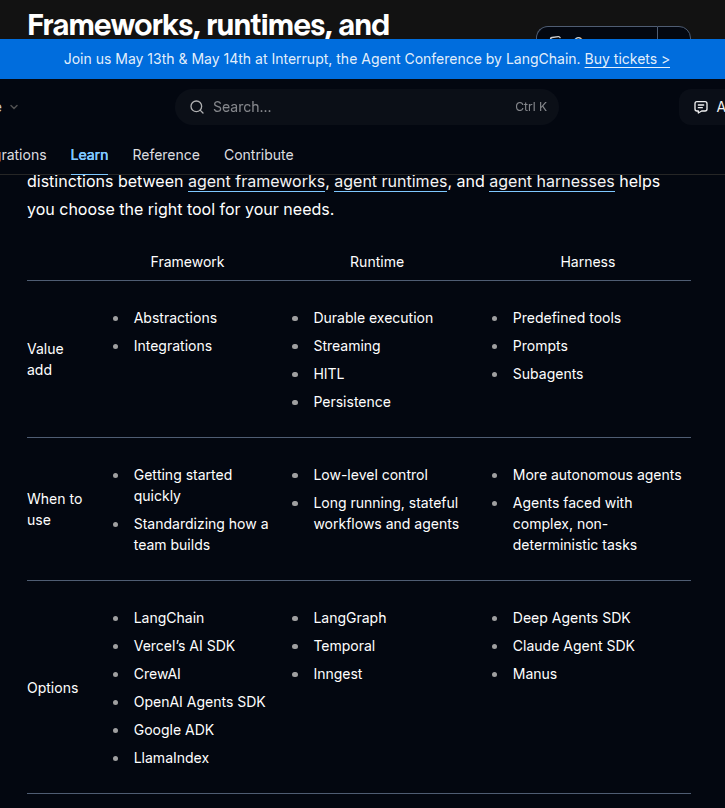

# LongChain Series Products
- [Differences between their products: LongGraph, LongChain, Deep Agent](https://docs.langchain.com/oss/python/concepts/products)
    - 

## [DeepAgent](https://reference.langchain.com/python/deepagents)
> Using an LLM to call tools in a loop is the simplest form of an agent. This architecture, however, can yield agents that are "shallow" and fail to plan and act over longer, more complex tasks.
> Applications like "Deep Research", "Manus", and "Claude Code" have gotten around this limitation by implementing a combination of four things: a planning tool, sub agents, access to a file system, and a detailed prompt.
> deepagents is a Python package that implements these in a general purpose way so that you can easily create a Deep Agent for your application. For a full overview and quickstart of Deep Agents, the best resource is our docs.
> Acknowledgements: This project was primarily inspired by Claude Code, and initially was largely an attempt to see what made Claude Code general purpose, and make it even more so.
    